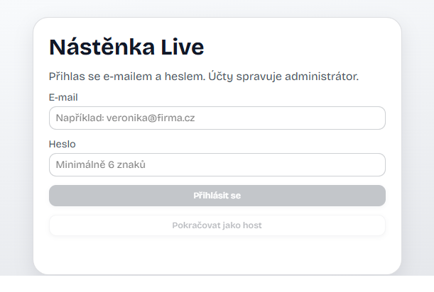
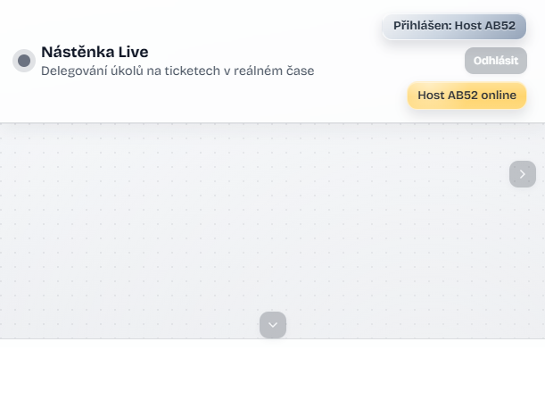
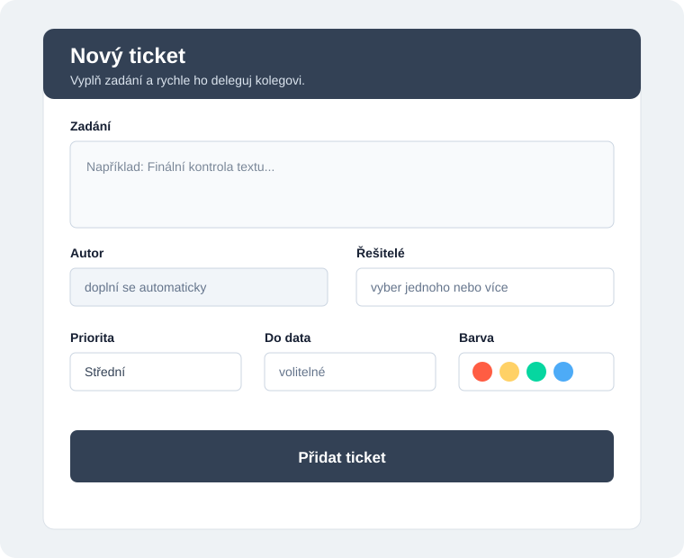
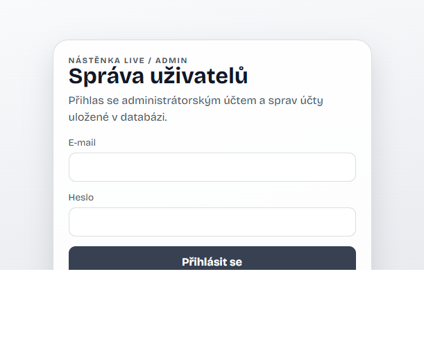

# Nástěnka Live

> **Uživatelská příručka** pro společnou online plochu ticketů.

Nástěnka Live slouží k zadávání, delegování a sledování úkolů v reálném čase. Změna provedená jedním uživatelem se po aktivním připojení zobrazí ostatním uživatelům.

## Obsah

- [Přístup a oprávnění](#přístup-a-oprávnění)
- [Rozhraní](#rozhraní)
- [Ticket](#ticket)
- [Filtrace a hromadné akce](#filtrace-a-hromadné-akce)
- [Spojnice](#spojnice)
- [Živý feed](#živý-feed)
- [Zprávy uživatelům](#zprávy-uživatelům)
- [Snapshoty](#snapshoty)
- [Účet a heslo](#účet-a-heslo)
- [Administrace](#administrace)
- [Řešení potíží](#řešení-potíží)

## Přístup a oprávnění

### Přihlášení

1. Otevřete adresu Nástěnky Live.
2. Zadejte e-mail a heslo.
3. Pokud potřebujete pouze náhled, zvolte **Pokračovat jako host**.

Po přihlášení se v horní liště zobrazí vaše jméno a seznam online uživatelů.

### Host

Host může prohlížet plochu, tickety, živý feed a online uživatele. Nemůže vytvářet, upravovat, přesouvat, řešit ani mazat tickety, spravovat spojnice, pracovat se snapshoty ani měnit heslo. Host nemá vlastní účet.

### Role

Přihlášený uživatel může podle svého oprávnění pracovat s obsahem nástěnky. Autor obvykle upravuje a maže své aktivní tickety; administrátor má rozšířená oprávnění včetně správy uživatelů a historie.

## Rozhraní

Levá svislá lišta obsahuje nástroje. Kliknutím nástroj otevřete, dalším kliknutím jeho panel zavřete.

| Nástroj | Účel |
| --- | --- |
| **Nový ticket** | Vytvoření a delegování ticketu. |
| **Filtrace** | Zobrazení ticketů podle řešitele. |
| **Zálohy** | Uložení nebo obnova snapshotu plochy. |
| **Spojnice** | Propojení dvou ticketů čárou. |
| **Můj účet** | Změna vlastního hesla. |
| **?** | Otevření tohoto manuálu. |

Plocha se pohybuje jako pracovní plátno. Vpravo najdete živý feed a přehled online uživatelů.

## Ticket

### Vytvoření

Ticket může vytvořit přihlášený uživatel s oprávněním k úpravám. Host režim slouží pouze k prohlížení.

1. V levé liště klikněte na **Nový ticket**. Alternativně klikněte na volné místo pracovní plochy a v nabídce **Co chceš přidat?** zvolte **ticket**.
2. Do pole **Zadání** napište popis úkolu. Text můžete formátovat tučně, kurzívou, velikostí, zarovnáním nebo doplnit smajlíkem.
3. V poli **Autor** zkontrolujte automaticky doplněné jméno.
4. V poli **Řešitelé** vyberte jednoho nebo více uživatelů. Více položek vyberete pomocí klávesy Ctrl nebo Shift.
5. Nastavte **Prioritu**: nízkou, střední nebo vysokou.
6. Volitelně vyplňte **Do data**.
7. Vyberte **Barvu**, která ticket odliší na ploše.
8. Klikněte na **Přidat ticket**. Ticket se objeví na ploše a změna se rozešle ostatním připojeným uživatelům.

Formulář obsahuje:

- **Zadání**: popis úkolu nebo požadavku.
- **Autor**: doplní se automaticky.
- **Řešitelé**: jeden nebo více uživatelů.
- **Priorita**: nízká, střední nebo vysoká.
- **Do data**: volitelný termín dokončení.
- **Barva**: barva ticketu na ploše.

Editor zadání podporuje tučné písmo, kurzívu, tři velikosti textu, zarovnání, smajlíky a vložení textu ze schránky. Pokud potřebujete vytvořit pouze text bez ticketu, použijte rychlou volbu **Čistý text**.

### Úpravy

Kliknutím ticket otevřete. Přetažením ho přesunete po ploše; úchyt na jeho okraji použijete ke změně velikosti. Podle oprávnění můžete změnit zadání, formátování, řešitele, prioritu, termín a barvu. Uložení změny se automaticky synchronizuje.

### Vyřešení

Klikněte na **Vyřešeno**. Ticket se přesune do archivu vyřešených ticketů. Pokud je archiv mimo aktuální výřez, zobrazí se vlevo dole směrová informace; kliknutím na ni přejdete k vyřešeným ticketům. Vyřešený ticket lze obnovit nebo odstranit.

## Filtrace a hromadné akce

V panelu **Filtrace** vyberte řešitele. Plocha zobrazí tickety přiřazené danému uživateli.

Pro hromadnou akci vyberte více ticketů přímo na ploše. Podle oprávnění je můžete označit jako vyřešené, upravit nebo smazat. Trvalé smazání vyžaduje potvrzení.

## Spojnice

1. Klikněte na **Spojnice**.
2. Klikněte na první ticket.
3. Klikněte na druhý ticket.

Konce spojnice se automaticky přepočítávají při přesunu nebo změně velikosti ticketu. Kliknutím na existující spojnici ji vyberete. Poté můžete ponechat její začátek a zvolit nový konec pomocí **Upravit spojnici**, nebo ji po potvrzení odstranit tlačítkem **Smazat spojnici**.

## Živý feed

**Živý feed** zobrazuje poslední události, například vytvoření, přesunutí, úpravu, vyřešení nebo smazání ticketu. Časy se zobrazují v časovém pásmu Europe/Prague.

Po každém spuštění serveru začíná nový běh feedu. Starší události zůstávají uložené a administrátor je může vyhledávat a exportovat v části **Analýza live feedu**.

## Zprávy uživatelům

Klikněte na jméno připojeného uživatele v přehledu v horní části obrazovky. Otevře se samostatné modální okno, do kterého napište zprávu a odešlete ji tlačítkem **Odeslat**. Zpráva se zobrazí pouze vybranému příjemci jako dočasné upozornění v pravé horní části pracovní plochy. Host zprávy posílat nemůže.

## Snapshoty

Panel **Zálohy** nabízí:

- **Uložit snapshot nyní**: uloží aktuální stav plochy.
- **Obnovit poslední snapshot**: načte nejnovější uložený stav.

Server ukládá změněnou plochu automaticky jednou za pět minut a uchovává tři nejnovější snapshoty. Snapshot obsahuje aktivní i vyřešené tickety, textové prvky, spojnice, pozice, rozměry, formátování a metadata.

Obnova nahradí aktuální stav plochy. Použijte ji proto pouze tehdy, když chcete obnovit uloženou verzi.

## Účet a heslo

Otevřete **Můj účet** kliknutím na ikonu účtu v levé liště.

1. Zadejte aktuální heslo.
2. Zadejte a zopakujte nové heslo.
3. Klikněte na **Změnit heslo**.

Heslo musí mít alespoň 6 znaků a musí se lišit od původního. Po změně zůstává přihlášení aktivní. Zapomenuté heslo může resetovat administrátor.

Odhlásíte se tlačítkem **Odhlásit** v levé liště, které je umístěné pod ikonou **Můj účet**.

## Administrace

Administrace je samostatná stránka na adrese `/admin.html`. Administrátor otevře **Můj účet** kliknutím na své jméno nebo ikonou účtu v levé liště; uvnitř panelu se zobrazí odkaz **Správa uživatelů**. Odkaz není samostatným tlačítkem v levé liště. Administrátor se přihlásí svým e-mailem a heslem.

Administrátor může:

- vytvářet, upravovat a mazat účty,
- měnit uživatelské jméno, e-mail, roli a barvu,
- nastavovat nebo resetovat hesla,
- vyhledávat historické události podle textu, uživatele a data,
- mazat vybrané záznamy aktivity,
- exportovat live feed a snapshoty ve formátu JSON nebo CSV.

Při úpravě účtu není nutné vyplňovat heslo, pokud ho nechcete změnit.

### Kompletní reset nástěnky

V dolní části administrace je nevratná operace **Kompletní reset nástěnky**. Po zadání aktuálního hesla a přesného potvrzení `RESET` odstraní všechny tickety, texty, spojnice, snapshoty a záznamy aktivity. Uživatelské účty zůstanou zachované.

Před resetem ověřte, že data už nepotřebujete. Operaci nelze vrátit běžnou obnovou snapshotu.

## Řešení potíží

### Změny se nezobrazují

Obnovte stránku a zkontrolujte, zda používáte správný účet. Synchronizace probíhá pouze při aktivním připojení k serveru.

### Nevidím nástroje pro úpravy

Pravděpodobně jste přihlášeni jako host nebo váš účet nemá oprávnění měnit obsah.

### Nemohu obnovit snapshot

Obnova je dostupná pouze přihlášeným uživatelům s odpovídajícím oprávněním. Ověřte také, zda byl snapshot skutečně uložen.
